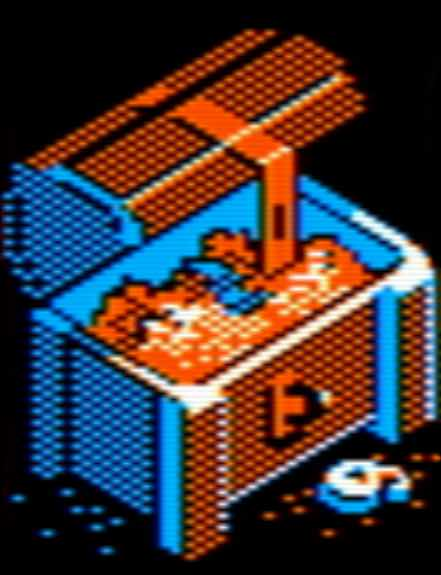
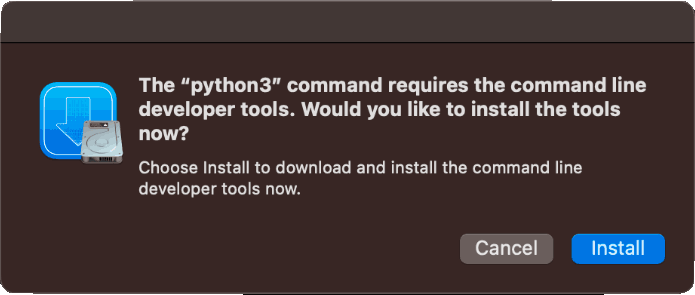

# ljdump # 

## A Livejournal or Dreamwidth archive tool ##

This program reads the journal entries from a Livejournal or Dreamwidth (or compatible) blog site and archives them in a subdirectory named after the journal name.  First it places all the data in a SQLite database, then it uses that to generate browseable HTML pages:

* One page per entry, with comments shown in their original threaded structure.
* History pages with 20 entries each, ordered by date, for as many pages as needed.
* A table of contents page with links to the above, and to entries organized by tag.

Page structure is as close as possible to what Dreamwidth renders, so you can drop in your own stylesheet and the result will look a lot like your own journal.

The script keeps track of where it left off the last time it was run, so the next time you run it, it will only fetch the entries and comments that have changed.

### An image cache ###

I put a lot of my photos and pixel art in my journal, and an archive would be kind of lame without them.  That's why this script can also attempt to store local copies of the images embedded in journal entries.  It organizes them by month in an images folder next to all the HTML.

This is an optional step, and it's off by default.  To run it you need to use the `--cache_images` argument when you invoke the script.

Every time you run it, it will attempt to cache 200 more images, going from oldest to newest.  It will skip over images it's already tried and failed to fetch, until 24 hours have gone by, then it will try those images once again.

The image links in your entries are left unchanged in the database.  They're swapped for local links only in the generated HTML pages.

### Limitations ###

This script uses the XML-RPC API to communicate with Livejournal and its descendents.  There is some information that is just not available using this protocol, such as:

* Full names of journals
* Theme information for moods
* The specific icons set by commenters in their comments

So, it's not possible to get the local HTML to look exactly like your online journal.

## How to use ##

__To get the full archive of a very large journal, you may need to run the script a few times in a row, until it says there are no new changes.__

The simplest way to run this is to execute the **ljdump.py** script in your terminal program of choice, for example:

`./ljdump.py --cache_images`

On MacOS, if you haven't ever run a Python 3 script before on your machine, a window may pop up from Apple saying you need to install the developer tools, like so:

This is normal.  Just let it download and install, and then try running the command again.

The script will then prompt you for your journal username and password, and begin downloading all your journal entries, comments, and userpics.

You may optionally download entries from a different journal (a community) where you are a member. If you are a community maintainer, you can also download comments from the community.

## Using the configuration file ##

If you want to save your username and password so you don't have to type it every time you run ljdump, you can save it in the configuration file.

The configuration is read from "ljdump.config". A sample configuration is provided in "ljdump.config.sample", which should be copied and then edited.

The configuration settings are:

* __server__ - The XMLRPC server URL.

  This should only need to be changed if you are dumping a journal that is livejournal-compatible but is not livejournal itself.

* __username__ - The livejournal user name.

  A subdirectory will be created with this same name to store the journal entries.

* __password__ - The account password.

  This password is sent in the clear, so if you specify an alternative server, ensure you use a URL starting with https:// so the connection is encrypted. If not provided here, will prompt for it when run.

* __journal__ - Optional: The journal to download entries from.

  If this is not specified, the "username" journal is downloaded. If this is specified, then only the named journals will be downloaded.  This element may be specified more than once to download multiple journals.

### Command line options ###

`--quiet`

Makes the script print a lot less status information to the console as it runs.

`--nohtml`

By defualt, this script constructs HTML pages after saving everything to the SQLite database.  This flag skips the HTML.

`--fifty`

Only fetch 50 of the entries that are new since the last sync, then stop.  Useful for testing the script output before you commit to downloading your whole journal.

`--cache_images`

Activates the image caching.  The script will attempt to cache 200 images at a time.  If it fails to cache an image it will skip it for 24 hours, even if the script is run again during that time.

Note that you can run the script that generates the HTML by itself, skipping over the synchronization process.  Running it repeatedly will let you cache lots of images without bothering the journal servers:

`./ljdumptohtml.py --cache_images`

## Have fun!  ##

You should know that there's no warranty here, and no guarantee that Dreamwidth or Livejournal won't shut off their XML-RPC protocol at some point.  Try not to aggravate them by downloading your journal a thousand times, mmmkay?

A Livejournal [community](https://ljdump.livejournal.com) was set up for questions or comments on the original version of this script back in 2009, but it has not seen attention for years.  Say [hello to me here](https://garote.dreamwidth.org/330489.html) if you have feedback.
